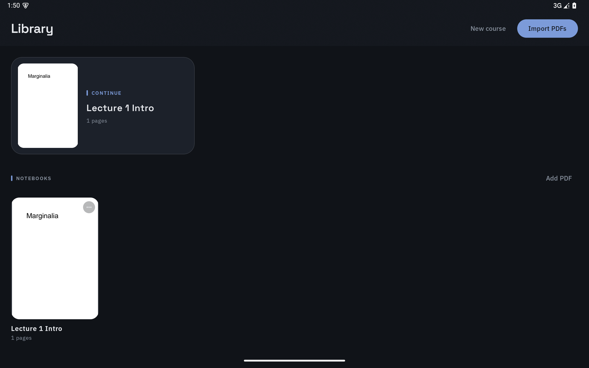
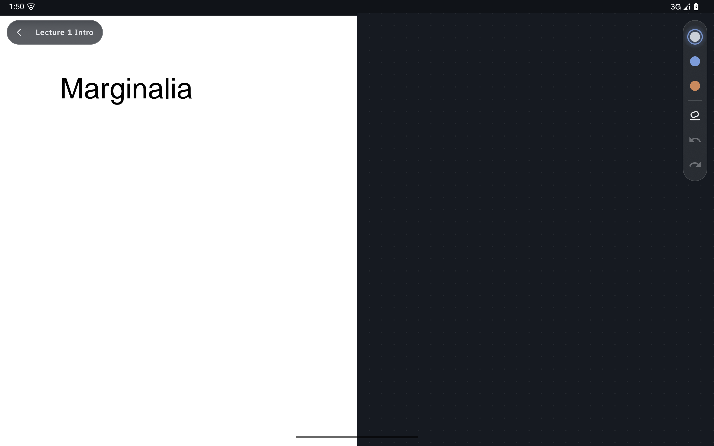

<div align="center">

# Marginalia

**Handwritten lecture notes next to the slides, for Android tablets.**

[](https://github.com/Serendeep/marginalia/actions/workflows/ci.yml)
[](LICENSE)
[](https://developer.android.com/about/versions/10)
[](https://kotlinlang.org)

&nbsp;

</div>

Your professor's slides already say most of it. Marginalia gives you the
margin: each PDF page gets a writable strip beside it, so your notes live
next to the slide they belong to and stay anchored there. The stylus draws;
your finger scrolls and zooms. No mode toggle.

Offline-first, no account, no cloud. Your notes stay on your tablet.

## Features

- ✍️ **Write beside the page, not on it.** Every PDF page gets its own margin canvas.
- 📌 **Notes stay anchored.** Strokes are tied to the page you wrote them against.
- 🖐️ **Stylus draws, finger navigates.** Palm-friendly. Nothing to switch.
- 📚 **Course library.** Import lecture PDFs, organized by course, with page thumbnails.
- 🧭 **Outline sheet.** Jump around long decks from the PDF's table of contents.
- ↩️ **Undo, redo, erase.** Haptic feedback, low-latency ink.
- 📴 **Fully offline.** No account, and no Google Play Services needed.

The [roadmap](ROADMAP.md) is where this is headed next: ink directly on the
page, a highlighter, course colors and emoji, empty notebooks, and opening
PDFs from any app.

## Building

You need JDK 17 and the Android SDK.

```
./gradlew :app:installDebug
```

Launch from the tablet, or over adb:

```
adb shell am start -n com.serendeep.marginalia/.MainActivity
```

## Testing

```
./gradlew test
```

The connected suite (`./gradlew connectedDebugAndroidTest`) uninstalls the
app when it finishes, **which deletes all app data. Run it on an emulator
only**, never on a tablet you take notes on.

## Built with

- [Kotlin](https://kotlinlang.org) + [Jetpack Compose](https://developer.android.com/compose) + Hilt
- [Room](https://developer.android.com/training/data-storage/room) for storage
- [pdfium](https://github.com/legere-org/pdfiumandroid) for PDF rendering
- [androidx.ink](https://developer.android.com/jetpack/androidx/releases/ink) for handwriting

## Contributing

Bug reports, screenshots of broken layouts, and PRs are all welcome: see
[CONTRIBUTING.md](CONTRIBUTING.md). Licensed under [GPL-3.0](LICENSE).
