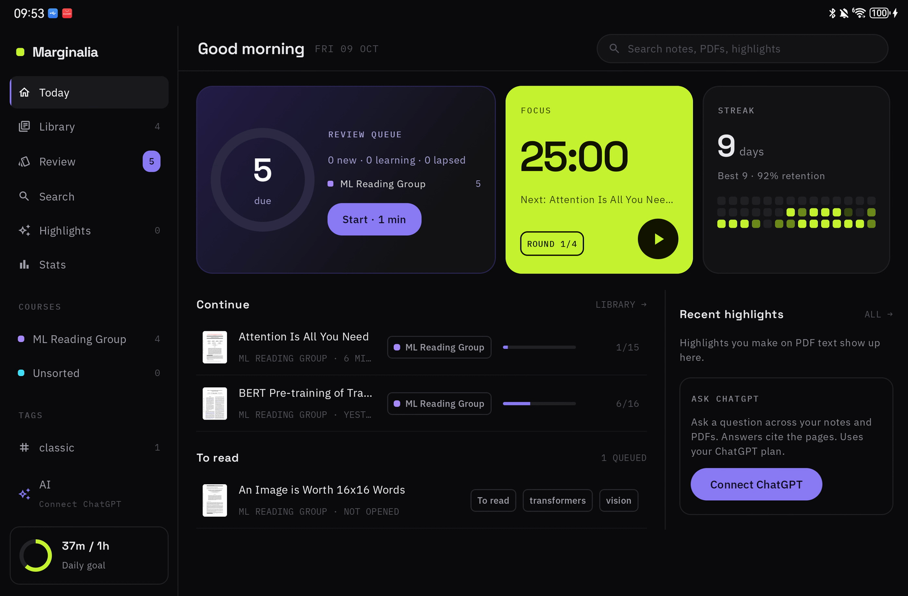
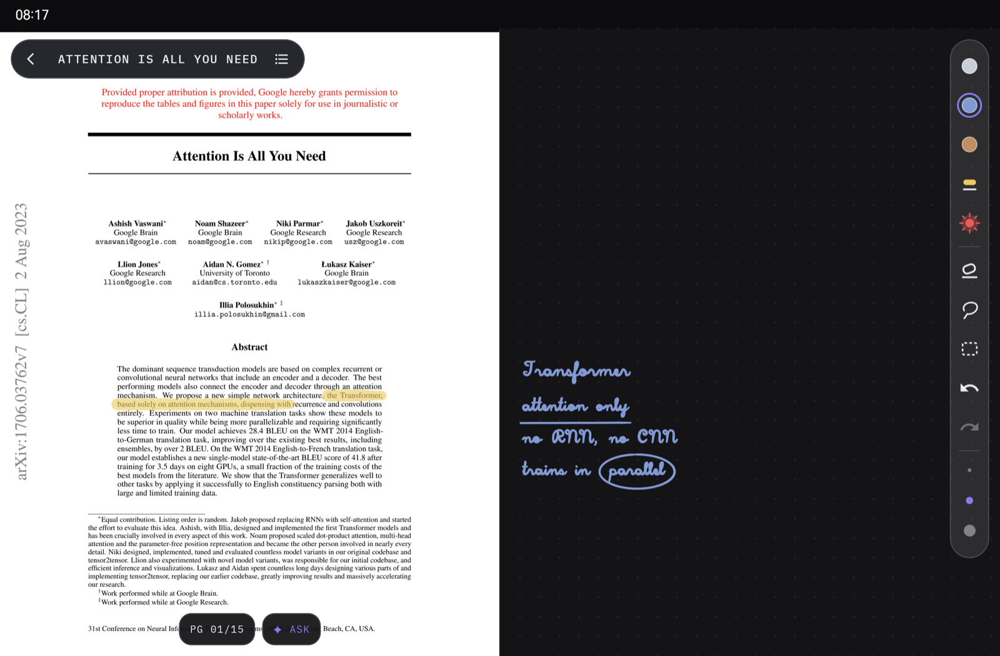
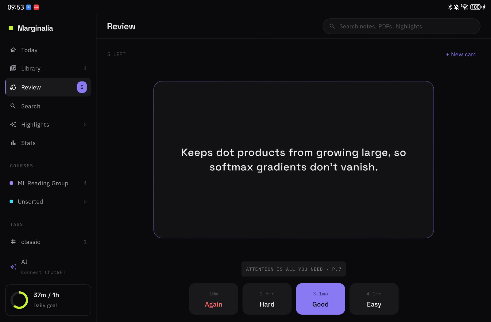
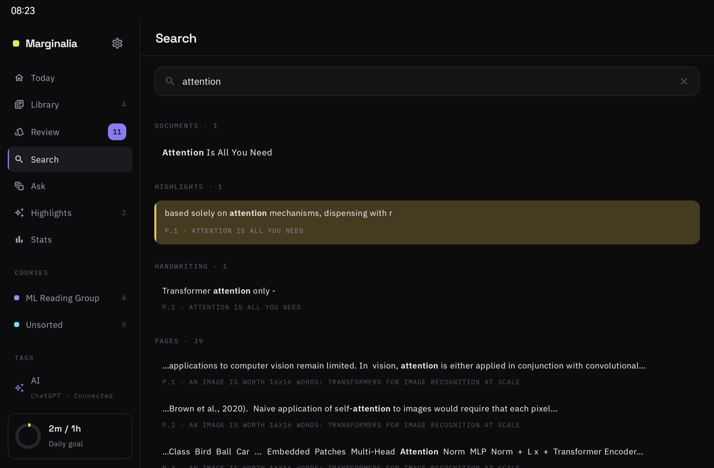
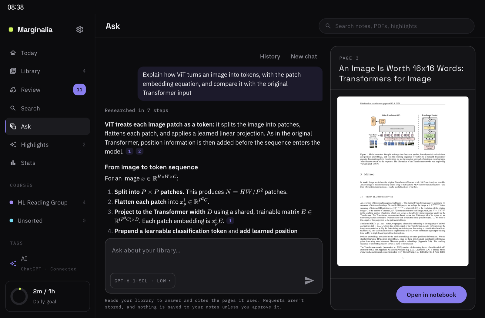
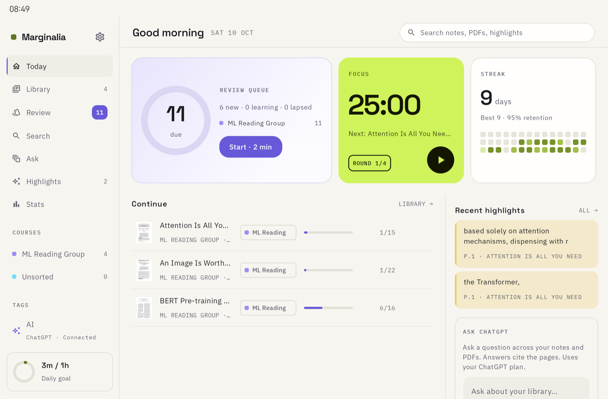

<div align="center">


# Marginalia

**Handwritten study notes beside your PDFs, for Android tablets.**

[](https://github.com/Serendeep/marginalia/actions/workflows/ci.yml)
[](LICENSE)
[](https://developer.android.com/about/versions/10)
[](https://kotlinlang.org)


https://github.com/user-attachments/assets/2c2c90d6-3aac-4872-a96d-f7fc41e34daa


&nbsp;
&nbsp;
&nbsp;

</div>

Lecture slides, papers and textbooks already say most of it. Marginalia gives you
the margin: every PDF page gets a writable strip beside it, so your notes live
next to the passage they belong to. Then it helps you actually remember them,
with flashcards, spaced review, and search that reads your handwriting.

The stylus writes; your finger scrolls and zooms. Offline-first, no account, no
cloud required. Your notes stay on your tablet.

## Features

**Write**
- ✍️ **Write beside the page, or on it.** A margin canvas next to every PDF page, plus ink directly on the page.
- 🖍️ **Smart highlighter.** Highlighter strokes straighten onto the text lines underneath and capture the text.
- 🔷 **Hold to shape.** Draw a line, arrow, circle, box or triangle and hold the nib; it snaps clean.
- 🧽 **Scratch out to erase**, eraser sizes, and a lasso to move, scale, recolour or copy ink.
- 🎨 **Pen widths and colours**, a laser pointer, and a configurable M-Pencil double-tap.

**Remember**
- 🗂️ **Flashcards from anything.** Lasso a region, turn a highlight into a cloze card, or type one.
- 🔁 **Spaced repetition** (SM-2) with a daily review queue and a gentle evening reminder.
- 🔎 **Search everything.** PDF text, highlights, and your own handwriting, recognised on-device.

**Stay on track**
- 📅 **Today dashboard.** What's due, what to continue, and a focus timer, at a glance.
- 🔥 **Study time tracks itself**, with a daily goal, streaks and a Stats screen.
- 📚 **Library for courses and papers.** Tags, reading status, arXiv/DOI detection and one-tap BibTeX.

**Optional AI**
- ✦ **Ask your library.** It searches your papers, reads the pages and checks figures before it answers,
  then cites each claim with numbered sources you can tap to open the page. Answers render math, tables
  and diagrams.
- 📝 **Ask beside the page.** In a notebook it knows the page you're on and your notes on it: explain a
  page, summarise the paper, draft flashcards, or lasso a figure and ask about it.
- It uses your ChatGPT plan through OpenAI's "Sign in with ChatGPT", with no API key, and you can pick the
  model and effort for each action. Nothing is sent unless you ask. Any OpenAI-compatible endpoint (for
  example Ollama) works too.

See the [roadmap](ROADMAP.md) for what's next.

## Building

You need JDK 17 and the Android SDK.

```
./gradlew :app:installDebug
```

Launch from the tablet, or over adb:

```
adb shell am start -n com.serendeep.marginalia/.MainActivity
```

## Testing

```
./gradlew test
```

The connected suite (`./gradlew connectedDebugAndroidTest`) uninstalls the
app when it finishes, **which deletes all app data. Run it on an emulator
only**, never on a tablet you take notes on.

The current emulator suite runs 28 tests, including database migration,
lecture CRUD, PDF import, zoom, links, and ink behavior.

## Releases

Release Please opens and maintains a release PR from conventional commits on
`main`. Merge that PR to create the GitHub Release, build a signed APK, attach
it to the release, and publish it to GitHub Packages as
`com.serendeep.marginalia:marginalia`.

Before the first release, add these repository Actions secrets:

- `SIGNING_KEYSTORE_BASE64` — base64-encoded Android keystore
- `SIGNING_STORE_PASSWORD`
- `SIGNING_KEY_ALIAS`
- `SIGNING_KEY_PASSWORD`

## Built with

- [Kotlin](https://kotlinlang.org) + [Jetpack Compose](https://developer.android.com/compose) + Hilt
- [Room](https://developer.android.com/training/data-storage/room) for storage
- [pdfium](https://github.com/legere-org/pdfiumandroid) for PDF rendering
- [androidx.ink](https://developer.android.com/jetpack/androidx/releases/ink) for handwriting

## Contributing

Bug reports, screenshots of broken layouts, and PRs are all welcome: see
[CONTRIBUTING.md](CONTRIBUTING.md). Licensed under [GPL-3.0](LICENSE).
